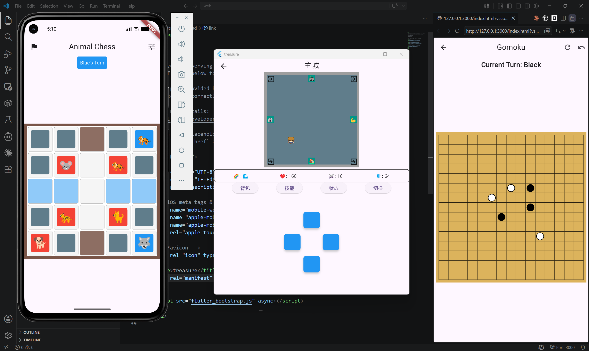
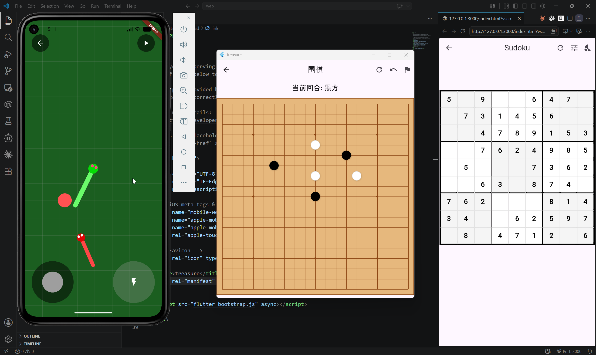
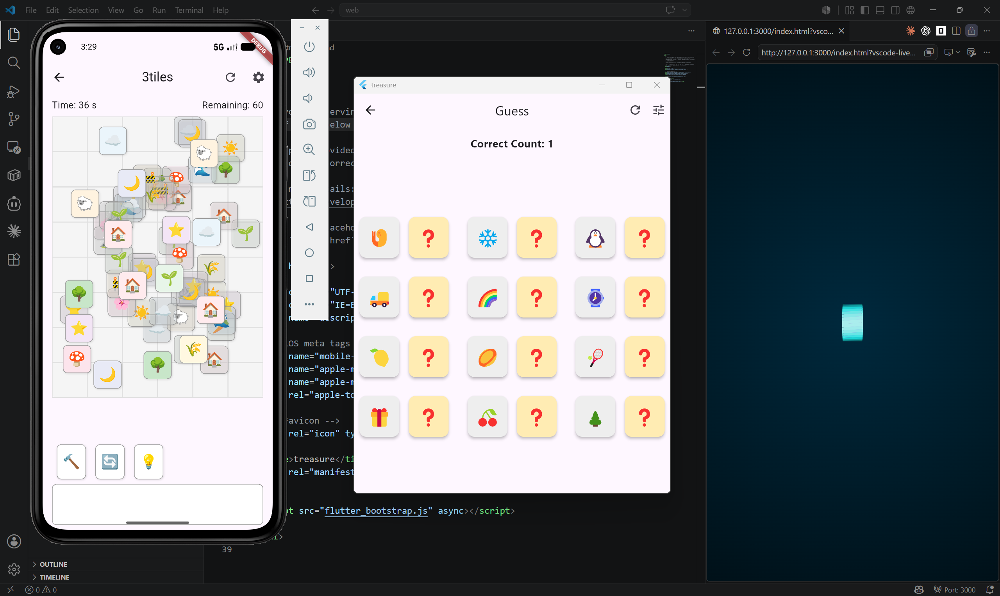
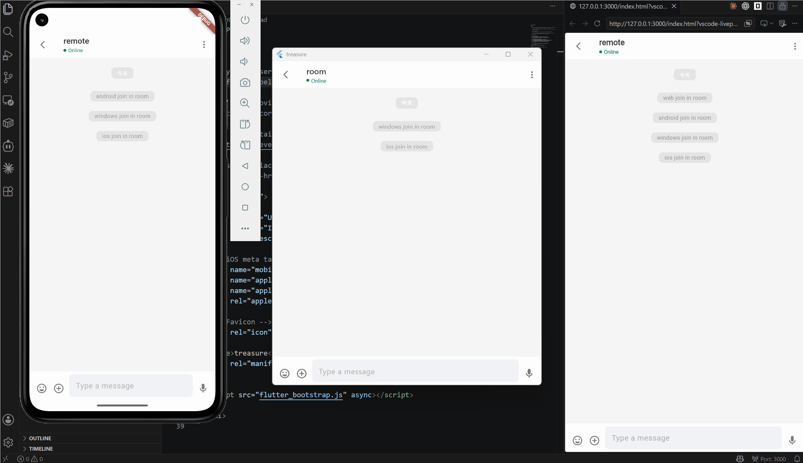
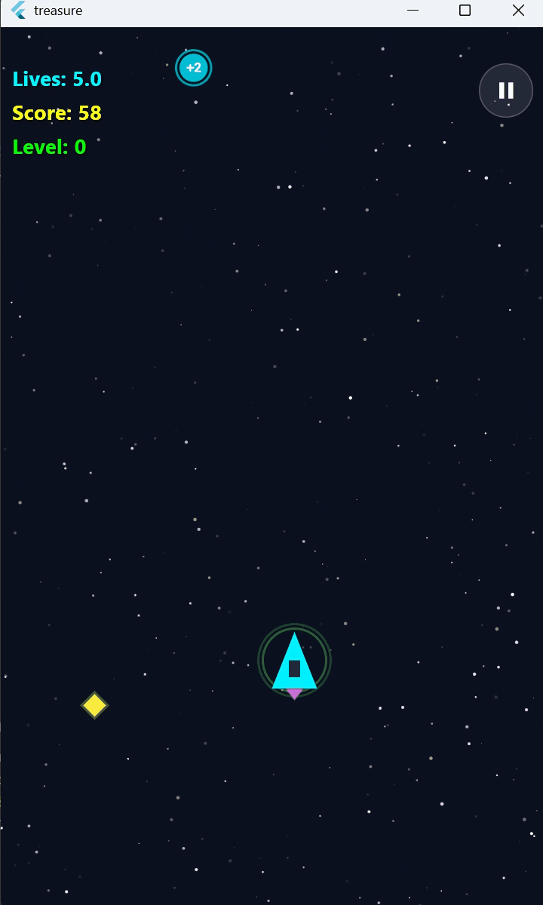
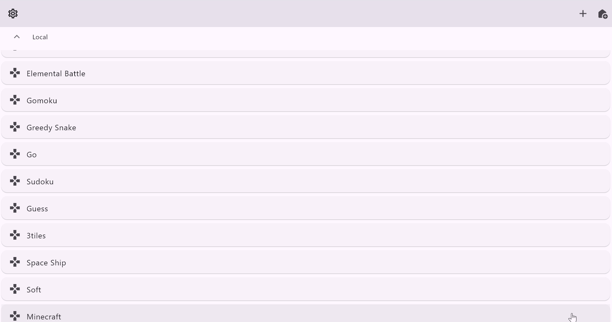

<p align="center">
  <h1 align="center">🧰 Treasure</h1>
  <p align="center">
    <b>A treasure for developer, featuring multiple cross-platform applications built with Flutter</b><br/>
    <i>个人开发者的百宝箱，包含多个基于Flutter构建的跨平台应用程序</i>
  </p>
</p>

<p align="center">
  
  
  
  
</p>

<p align="center">
  
  
  
</p>

---

## 🎮 Play Now | 立即体验

> **👉 [Click here to play in browser](https://rebort-a.github.io/treasure/)** 👈
>
> No install. No download. Just open and play.
>
> 六端合一，无界通信，无需安装，即刻体验web端。

### Preview | 预览

| | | |
|:---:|:---:|:---:|
|  |  |  |
|  |  |  |

---

## 💡 What Is This? | 这是什么？

A treasure box containing multiple applications — from a simple local Gobang to a multiplayer Minecraft. | 
包含多款应用的百宝箱，小到单机版五子棋，大到多人联机我的世界。拆解每一款应用/游戏背后的原理，并进行复刻。

Every app/game is reverse-engineered and rebuilt from scratch. All apps share one framework with the same design philosophy and directory structure, with strict layer dependencies. Master one, and you can seamlessly pick up the next. | 所有应用都复用同一款框架，有相同的设计理念和目录结构，层与层之间的依赖关系严格清晰，学完一款可以无缝衔接下一款。

Six platforms, one codebase. No central server required — LAN multiplayer works out of the box. | 六端合一，无界通信。无需中心服务器，局域网也可联机。

The code principle is simplicity and zero dependencies. Whether it's networking or 3D rendering, everything is hand-written. Reusable code is fully reused. Simple code, powerful results — a perfect tutorial for beginners. | 代码原则是简约和零依赖，无论是网络通信还是3D效果，全部手搓，能复用的代码全部复用，简单的代码实现强大的功能，堪称新手教学典范。

---

## 📦 Application List | 应用列表

| # | Name | 名称 | Type | Description | 特色 |
|---|------|------|------|-------------|------|
| 02 | **LAN Chat** | 局域网聊天 | LAN | 文字/图片/文件聊天，表情面板 | 毛玻璃 UI、BlurHash 渐进加载、XOR 加密传输 |
| 03 | **Animal Chess** | 斗兽棋 | Local + LAN | 经典斗兽棋，翻棋对战 | 回合制联机引擎 |
| 04 | **Elemental Battle** | 五行对决 | Local + LAN | 五行 RPG，25 种独特技能 | 五行相克、迷宫探索、道具商店、Boss 战 |
| 05 | **Gobang** | 五子棋 | Local + LAN | 五子连珠，支持悔棋 | 联机对战 |
| 06 | **Greedy Snake** | 贪吃蛇 | Local + LAN | 多人贪吃蛇 | 空间网格碰撞检测、实时对战 |
| 07 | **Go** | 围棋 | Local + LAN | 完整围棋规则 | 提子、打劫、禁入、联机对弈 |
| 08 | **Sudoku** | 数独 | Local | 自动生成谜题 | 多难度等级 |
| 09 | **Guess** | 猜词 | Local | Emoji 猜词 | 趣味猜词玩法 |
| 10 | **Three Tiles** | 三消麻将 | Local | 三消玩法 | 道具系统 |
| 11 | **Spaceship** | 太空飞船 | Local | 俯视角射击 | Boss 战、道具、成就系统 |
| 12 | **Soft Body** | 软体模拟 | Local | 弹簧-质点物理模拟 | 欧拉/Verlet 双积分、3D 三角网格 |
| 13 | **Minecraft** | 我的世界 | Local | 纯 Dart 3D 体素引擎 | 程序化世界（7 种生物群系）、八叉树+裁剪+面合并优化、AABB 碰撞物理 |

> `01.home` — Home page router, not listed above.

---

## 🏗️ Architecture | 架构设计

All modules follow a consistent **three-layer architecture** with two organizational patterns:

所有模块遵循统一的**三层架构**，有两种组织方式：

All modules share the same logical **three-layer architecture** (base → middle → upper), organized in two physical patterns:

所有模块共享同一套**三层架构**（base → middle → upper），物理组织方式有两种：

### Pattern A: Standard Framework | 标准框架

Each layer is a subdirectory. Used by complex modules (`04.elemental_battle`, `13.minecraft`):

各层为独立子目录，用于复杂模块：

```
┌─────────────────────────────────────────────────┐
│  upper/     UI pages, rendering, user interaction │
│             UI 页面、渲染、用户交互                 │
├─────────────────────────────────────────────────┤
│  middle/    Business logic, algorithms, rules     │
│             业务逻辑、算法、游戏规则                 │
├─────────────────────────────────────────────────┤
│  base/      Data models, constants, definitions   │
│             数据模型、常量、核心定义                 │
└─────────────────────────────────────────────────┘
```

```
04.elemental_battle/
├── base/     # elements, skills, items, maps...
├── middle/   # battle logic, AI, maze generation...
└── upper/    # pages, widgets, HUD...

13.minecraft/
├── base/     # vector, matrix, aabb, block, chunk, octree...
├── middle/   # manager, world_generator, chunk_manager...
└── upper/    # page, widget, scene_render, frustum...
```

### Pattern B: Flat Framework | 扁平框架

Each layer is a single file within the module root. Used by the remaining modules (#02–#03, #05–#12):

各层为模块根目录下的单个文件，用于其余模块：

```
├── base.dart               # Data models | 数据模型 (base)
├── foundation_manager.dart # Shared logic | 通用逻辑
├── local_manager.dart      # Local mode logic | 单机逻辑 (middle)
├── local_page.dart         # Local mode UI | 单机界面 (upper)
├── net_manager.dart        # LAN mode logic | 联机逻辑 (middle)
└── net_page.dart           # LAN mode UI | 联机界面 (upper)
```

> Note: Simpler modules (#08–#12, no LAN mode) omit `net_*` files and may merge foundation/local logic into a single `manager.dart`. | 注意：纯单机模块（#08–#12）无 `net_*` 文件，`foundation_manager.dart` 与 `local_manager.dart` 可能合并为 `manager.dart`。

### Project Layout | 项目目录

```
lib/
├── 00.common/       # Shared modules (engine, network, widgets)
│   ├── engine/      # Network engines (base, turn-based, real-time)
│   ├── network/     # UDP/TCP/WebSocket, encryption, room discovery
│   └── widget/      # Reusable UI components
├── 01.home/         # Home page
├── 02.lan_chat/     # LAN chat room (flat)
├── 03.animal_chess/ # 斗兽棋 (flat)
├── 04.elemental_battle/ # 五行对决 (standard)
├── 05.gobang/       # 五子棋 (flat)
├── ...
└── 13.minecraft/    # 3D voxel engine (standard)
```

---

## 🌐 Network Architecture | 网络架构

Dual network mode, switchable via one line in `lib/00.common/config/network_config.dart`:

双网络方案，通过 `lib/00.common/config/network_config.dart` 一行切换：

```dart
const NetworkMode networkMode = NetworkMode.socket;     // TCP + UDP (native)
const NetworkMode networkMode = NetworkMode.webSocket;   // WebSocket (Web)
```

```
┌───────────────────────────────────────────────────────┐
│  Application Layer | 应用层                             │
│  NetworkEngine / NetTurnGameEngine / NetRealGameEngine │
├───────────────────────────────────────────────────────┤
│  Message Protocol | 消息协议层                           │
│  NetworkMessage (JSON + XOR encryption)                │
├───────────────────────────────────────────────────────┤
│  Transport Layer | 传输层                               │
│  socket: TCP ServerSocket + UDP broadcast/multicast    │
│  webSocket: HttpServer + WebSocket + HTTP discovery    │
└───────────────────────────────────────────────────────┘
```

- **Room Discovery** — UDP broadcast/multicast (socket) or HTTP scan (WebSocket) | 房间发现
- **Reliability** — ACK + retry for critical messages | 关键消息确认重试
- **Reconnection** — Exponential backoff (1s→2s→4s→8s→16s, max 5 attempts) | 指数退避重连
- **Encryption** — XOR stream encryption with room-shared key | 数据加密传输

---

## 📦 Dependencies | 依赖说明

> **为了提高用户体验，引入了一些增益插件，下面提供删除方法，便捷改回零依赖。**

| 依赖 Dependency | 引入原因 Reason | 涉及文件 Files | 删除方法 Removal | 删除后影响 Impact |
|------|---------|---------|---------|----------|
| `web_socket_channel` | 兼容 Web 端联机通信<br/>WebSocket support for Web | `00.common/network/connection.dart` | 在 `lib/00.common/config/network_config.dart` 改为 `NetworkMode.socket`，删除 WebSocket 分支代码<br/>Switch to `NetworkMode.socket`, delete WebSocket branch | Web 端无法联机，原生平台不受影响<br/>Web loses LAN, native platforms unaffected |
| `http` | Web 端 HTTP 获取房间信息（名称、加密密钥等）<br/>Fetch room info (name, encryption key) for Web | `00.common/network/http_fetch.dart` | 删除 `http_fetch.dart` 文件<br/>Delete `http_fetch.dart` | Web 端手动加入房间时无法获取房间名和加密密钥<br/>Web cannot fetch room name & encryption key when joining by IP |
| `image_picker` | 聊天发送图片<br/>Send images in chat | `02.lan_chat/net_page.dart` | 删除 `_pickImage()` 方法，附件菜单自动隐藏相册选项<br/>Delete `_pickImage()`, attachment menu auto-hides album | 聊天无法发送图片<br/>Cannot send images |
| `file_picker` | 聊天发送/保存文件<br/>Send & save files in chat | `02.lan_chat/net_page.dart`、`00.common/widget/component/chat_component.dart` | 删除 `_pickFile()` 方法和 `_saveFile()` 中的 FilePicker 调用<br/>Delete `_pickFile()` and FilePicker calls in `_saveFile()` | 聊天无法发送和保存文件<br/>Cannot send or save files |
| `path_provider` | 获取应用专属存储目录<br/>App-specific storage directory | `00.common/tool/storage_service.dart` | 删除 `StorageService` 中相关代码，改用 `Directory.current`<br/>Remove related code, use `Directory.current` | Android/iOS 无法持久化设置和进度，桌面端不受影响<br/>Android/iOS lose persistence, desktop unaffected |
| `cupertino_icons` | iOS 风格图标<br/>iOS style icons | 全局 Global | 用 Material Icons 替代后从 `pubspec.yaml` 移除<br/>Replace with Material Icons, remove from pubspec | 无功能影响，仅图标风格变化<br/>No functional impact, icon style only |

> **平台权限 Platform Permissions**：`image_picker` 需要 Android `READ_MEDIA_IMAGES`（13+）/ `READ_EXTERNAL_STORAGE`（12-）和 iOS `NSPhotoLibraryUsageDescription`。`file_picker` 需要 Android `WRITE_EXTERNAL_STORAGE`（9-）。已在 `AndroidManifest.xml` 和 `Info.plist` 中声明，移除插件后可同步删除。
>
> `image_picker` requires Android `READ_MEDIA_IMAGES` (13+) / `READ_EXTERNAL_STORAGE` (12-) and iOS `NSPhotoLibraryUsageDescription`. `file_picker` requires Android `WRITE_EXTERNAL_STORAGE` (9-). Already declared in `AndroidManifest.xml` and `Info.plist`; remove alongside plugins.

---

## 🚀 Quick Start | 快速开始

### Prerequisites | 前置条件

- [Flutter SDK](https://flutter.dev/docs/get-started/install) ≥ 3.x

### Run | 运行

```bash
git clone https://github.com/rebort-a/treasure.git
cd treasure
flutter pub get
flutter run
```

### Build | 构建

```bash
# Web
flutter build web --release

# Android APK
flutter build apk --release

# Windows
flutter build windows --release

# iOS (requires macOS)
flutter build ios --release
```

### Test | 测试

```bash
flutter test
```

---

## 📖 Documentation | 文档

| Module | Link |
|--------|------|
| 🧊 Minecraft 3D Engine | [lib/13.minecraft/README.md](lib/13.minecraft/README.md) |
| 🤝 Contributing | [CONTRIBUTING.md](CONTRIBUTING.md) |
| 📋 Changelog | [CHANGELOG.md](CHANGELOG.md) |

---

## 📄 License | 开源协议

This project is licensed under the [MIT License](LICENSE).

本项目采用 [MIT 协议](LICENSE) 开源。

---

<p align="center">
  <i>Built with Flutter & curiosity. | 用 Flutter 和好奇心构建。</i><br/><br/>
  <b>⭐ If you find this interesting, give it a star! | 如果觉得有趣，点个 Star 吧！</b>
</p>
