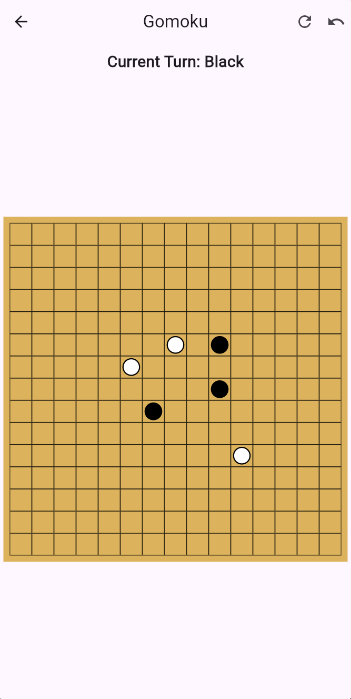
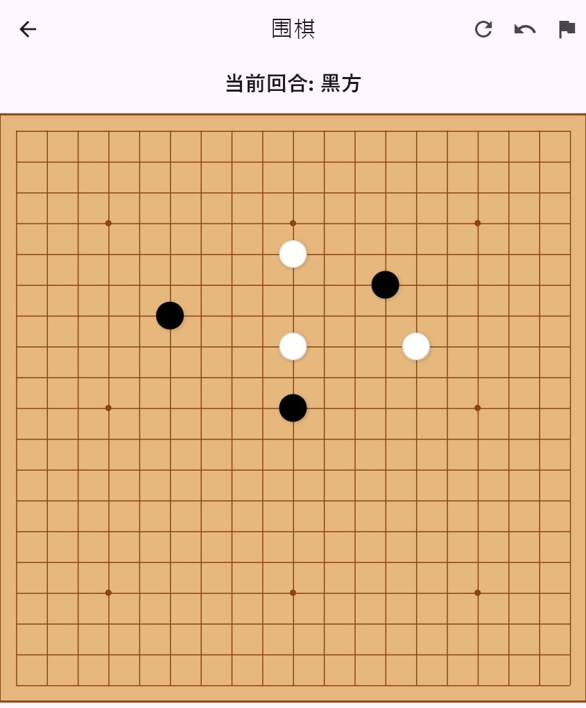
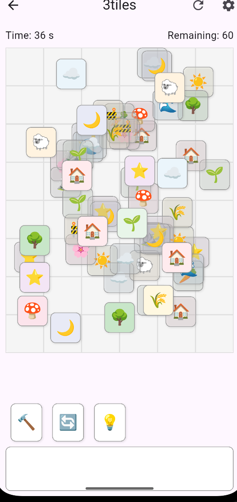
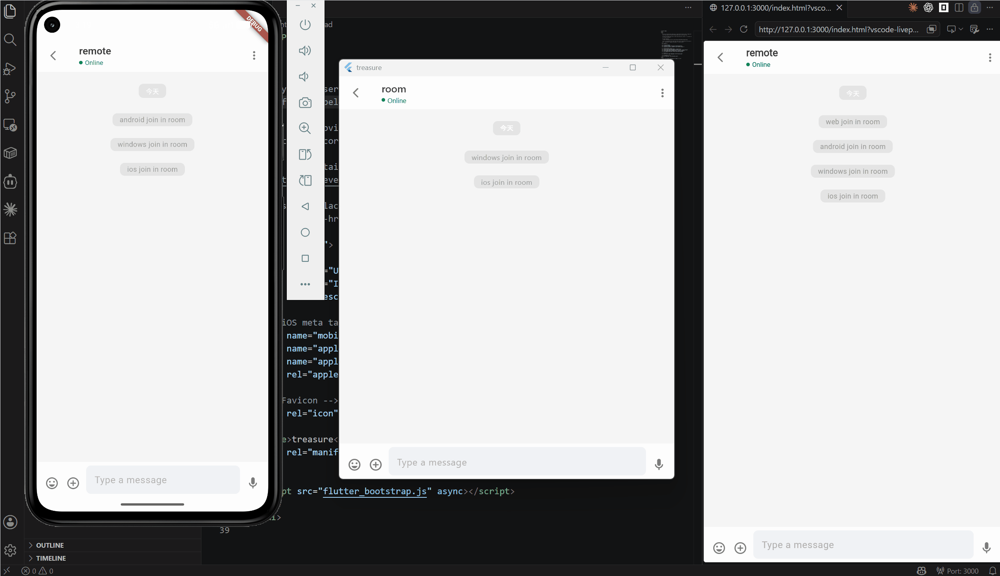
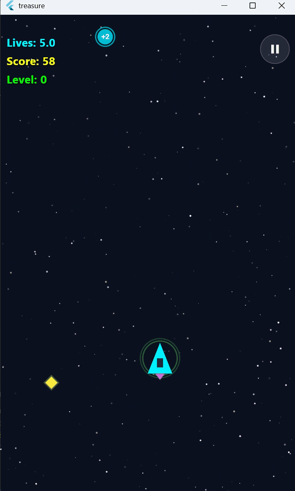
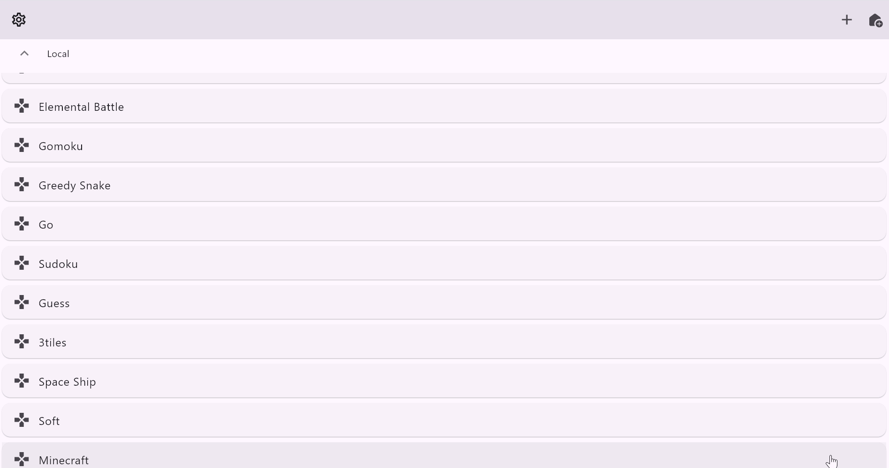

<p align="center">
  <h1 align="center">🧰 Treasure</h1>
  <p align="center">
    <b>A Flutter game lab: learn the rules, explore the engine, play over LAN</b><br/>
    <b>六端为一，无界互联</b><br/>
    <i>Flutter 游戏实验室：理解游戏规则，探索自研内核，体验局域网联机</i>
  </p>
</p>

<p align="center">
  
  
  
  
</p>

<p align="center">
  
  
  
</p>

---

## 🎮 Play Now | 立即体验

**[Play in browser](https://rebort-a.github.io/treasure/) · [Download native releases](https://github.com/Rebort-a/treasure/releases) · [Report a bug](https://github.com/Rebort-a/treasure/issues/new/choose)**

> **👉 [Click here to play in browser](https://rebort-a.github.io/treasure/)** 👈
>
> No install. No download. Just open and play.
>
> 无需安装，即刻体验单机游戏。Web 联机需要手动输入原生端房主的地址，且受浏览器连接策略限制；平台能力并不完全相同，见下方说明。

### Preview | 预览

| | | |
|:---:|:---:|:---:|
|  |  |  |
|  |  |  |

静态图片裁剪自仓库原有截图，展示历史版本玩法，不作为当前版本的视觉验收结果。| Static previews are cropped from existing repository screenshots and illustrate earlier versions.

---

## 💡 What Is This? | 这是什么？

A game lab for Flutter developers, from Gobang rules and AI to multiplayer synchronization and a Dart-powered voxel renderer. The primary goal is to make game internals readable and testable; LAN play is the shared hands-on experience. | 面向 Flutter 开发者的游戏实验室，从五子棋规则与 AI，到多人状态同步和 Dart 体素渲染。主目标是让游戏内核可阅读、可验证，局域网联机是贯穿各模块的实践场景。

Modules share networking, lifecycle hosts and UI components. Complex games use data / logic / UI directories; small games keep a simpler file layout. Some older managers still mix presentation responsibilities; see the [architecture guide](docs/architecture.md) for enforced boundaries and remaining work. | 模块共享网络、生命周期容器与界面组件，复杂游戏按数据/逻辑/UI 分目录，小游戏保留精简文件组织。旧模块仍有展示职责混合，已实施的约束与后续工作见[架构说明](docs/architecture.md)。

Six platform targets, one codebase. A native player hosts the room locally; no central server is required. | 一份代码面向六个平台，原生端玩家在本地建立房间，无需中心服务器。

Game rules and rendering algorithms are implemented in Dart. Convenience plugins are few and isolated in adapters rather than spread through game logic. | 游戏规则与渲染算法由 Dart 实现，少量便利插件集中在适配文件中，不分散到游戏内核；这不是整个应用“零依赖”的承诺。

### Start Here | 推荐阅读入口

| 想了解什么 | 从哪里开始 |
|---|---|
| 游戏规则、合法交换与确定性局面 | `lib/18.match_three/base/match_board.dart` |
| 数据内核如何驱动界面 | `lib/18.match_three/middle/match_manager.dart` |
| 多人回合、快照与同步确认 | `lib/00.common/network/client/net_multi_turn_engine.dart` |
| 房间连接与单局资源如何分离 | `lib/00.common/network/widget/online_game_host.dart` |
| 3D 投影、裁剪与面合并 | [体素引擎说明](lib/13.minecraft/README.md) |

### Platform Capabilities | 平台能力与边界

| 能力 | Android / iOS | Windows / macOS / Linux | Web |
|---|---|---|---|
| 单机游戏 | 支持 | 支持 | 支持 |
| 建立局域网房间 | 支持，依赖系统权限和网络环境 | 支持，需放行防火墙 | 不支持 |
| UDP 房间发现 | 支持，依赖网络允许广播 | 支持，依赖网络允许广播 | 不支持，手动输入地址 |
| 加入局域网房间 | 支持 | 支持 | 使用 WebSocket，受浏览器策略限制 |
| 本地设置和游戏记录 | 应用文档目录中的 `.treasure/` | 当前工作目录中的 `.treasure/` | 当前不持久化 |

“支持”表示当前代码实现的能力，不代表已完成所有设备与系统版本的实机验收。HTTPS 页面连接局域网明文 WebSocket 可能被浏览器拦截。房间密码用于入房校验；XOR 不能提供可靠的机密性或完整性保护，请仅在可信局域网中使用。

---

## 📦 Application List | 应用列表

| # | Name | 名称 | Type | Description | 特色 |
|---|------|------|------|-------------|------|
| 02 | **LAN Chat** | 局域网聊天 | LAN | 文字/图片/文件聊天，表情面板 | 毛玻璃 UI、BlurHash 渐进加载、XOR 轻量加密传输 |
| 03 | **Animal Chess** | 斗兽棋 | Local + LAN | 经典斗兽棋，翻棋对战 | AI 对手、回合制联机引擎 |
| 04 | **Elemental Battle** | 五行之战 | Local + LAN | 五行 RPG，25 种独特技能 | 五行相克、迷宫探索、道具商店、Boss 战 |
| 05 | **Gobang** | 五子棋 | Local + LAN | 五子连珠，支持悔棋 | AI 对手、联机对战 |
| 06 | **Greedy Snake** | 贪吃蛇 | Local + LAN | 多人贪吃蛇 | 空间网格碰撞检测、实时对战 |
| 07 | **Go** | 围棋 | Local + LAN | 完整围棋规则 | AI 对手、提子、打劫、禁入、联机对弈 |
| 08 | **Sudoku** | 数独 | Local | 自动生成谜题 | 多难度等级 |
| 09 | **Guess** | 猜枚 | Local | Emoji 猜枚 | 趣味猜枚玩法 |
| 10 | **Three Tiles** | 羊了个羊 | Local | 三消堆叠 | 道具系统、格子消除 |
| 11 | **Spaceship** | 星际战机 | Local | 俯视角射击 | Boss 战、道具、成就系统 |
| 12 | **Soft Body** | 软环 | Local | 弹簧-质点物理模拟 | 欧拉/Verlet 双积分、3D 三角网格 |
| 13 | **Minecraft** | 我的世界 | Local | 纯 Dart 3D 体素引擎 | 红石系统、距离雾效、水面/矿石生成、八叉树+裁剪+面合并优化 |
| 14 | **Tower Defense** | 塔防 | Local | 合作防守，随机地图 | 7 种防御塔、4 种敌人、20 波次、精灵动画 |
| 15 | **Memory Match** | 记忆翻牌 | Local | 翻牌配对记忆 | 难度/网格选择、计时挑战 |
| 16 | **Schulte** | 舒尔特 | Local | 注意力方格训练 | 规则/不规则模式、全屏棋盘、点击反馈 |
| 17 | **Tank Battle** | 坦克战 | Local + LAN | 合作防守坦克战 | 双摇杆自由瞄准射击、局域网联机防守 |
| 18 | **Match Three** | 消消乐 | Local + LAN | 随机棋盘与目标、多人轮流合作 | 原创动物待机动画、连锁消除、特殊棋子、共享步数与中途加入 |

> `01.home` — Home page router, not listed above.

---

## 🏗️ Architecture | 架构设计

All modules follow a consistent **three-layer architecture** with two organizational patterns:

所有模块遵循统一的**三层架构**，有两种组织方式：

### Pattern A: Standard Framework | 标准框架

Each layer is a subdirectory. Used by complex modules (`04.elemental_battle`, `13.minecraft`, `18.match_three`):

各层为独立子目录，用于复杂模块：

```
┌─────────────────────────────────────────────────┐
│  upper/     UI pages, rendering, user interaction │
│             UI 页面、渲染、用户交互                 │
├─────────────────────────────────────────────────┤
│  middle/    Business logic, algorithms, rules     │
│             业务逻辑、算法、游戏规则                 │
├─────────────────────────────────────────────────┤
│  base/      Data models, constants, definitions   │
│             数据模型、常量、核心定义                 │
└─────────────────────────────────────────────────┘
```

### Pattern B: Flat Framework | 扁平框架

Each layer is a single file within the module root. Used by LAN-capable modules (#02–#03, #05–#07):

各层为模块根目录下的单个文件，用于支持联机的模块：

```
├── base.dart               # Data models | 数据模型 (base)
├── foundation_manager.dart # Shared logic | 通用逻辑
├── local_manager.dart      # Local mode logic | 单机逻辑 (middle)
├── local_page.dart         # Local mode UI | 单机界面 (upper)
├── net_manager.dart        # LAN mode logic | 联机逻辑 (middle)
└── net_page.dart           # LAN mode UI | 联机界面 (upper)
```

### Pattern C: Compact Framework | 精简框架

Pure single-player games use a compact `base / manager / page` split, dropping the local/net separation (no LAN, no AI opponent):

纯单机游戏采用精简的 `base / manager / page` 划分，省略 local/net 分离（无联机、无 AI 对手）：

```
├── base.dart     # Data models | 数据模型 (base)
├── manager.dart  # Business logic | 业务逻辑 (middle)
└── page.dart     # UI | 界面 (upper)
```

Used by #08–#12, #14–#16. | 用于 #08–#12、#14–#16。

### Project Layout | 项目目录

```
lib/
├── 00.common/       # Shared modules (engine, network, widgets)
│   ├── engine/      # Network engines (base, turn-based, real-time)
│   ├── network/     # UDP/TCP/WebSocket, encryption, room discovery
│   └── widget/      # Reusable UI components
├── 01.home/         # Home page
├── 02.lan_chat/     # LAN chat room (flat)
├── 03.animal_chess/ # 斗兽棋 (flat)
├── 04.elemental_battle/ # 五行之战 (standard)
├── 05.gobang/       # 五子棋 (flat)
├── ...
├── 13.minecraft/    # 3D voxel engine (standard)
├── 14.tower_defense/ # Tower defense (flat)
├── 15.memory_card/  # Memory match (flat)
├── 16.schulte/      # Schulte grid (flat)
├── 17.tank/         # Tank battle (flat)
└── 18.match_three/  # Cooperative match-three (layered)
```

---

## 🌐 Network Architecture | 网络架构

Dual network mode, switchable via one line in `lib/00.common/config/network_config.dart`:

双网络方案，通过 `lib/00.common/config/network_config.dart` 一行切换：

```dart
const NetworkMode networkMode = NetworkMode.socket;     // TCP + UDP，原生平台
const NetworkMode networkMode = NetworkMode.webSocket;   // WebSocket，含 Web 平台
```

```
┌───────────────────────────────────────────────────────┐
│  Application Layer | 应用层                             │
│  SocketClient → RoomChatEngine → Turn/Real Engine      │
├───────────────────────────────────────────────────────┤
│  Message Protocol | 消息协议层                           │
│  NetworkMessage (JSON + XOR encryption)                │
├───────────────────────────────────────────────────────┤
│  Transport Layer | 传输层                               │
│  socket: TCP ServerSocket + UDP broadcast/multicast    │
│  webSocket: HttpServer upgrade + WebSocket            │
└───────────────────────────────────────────────────────┘
```

- **Room Discovery** — UDP discovery on native platforms; Web joins by IP. Room type and key arrive in the `accept` handshake. | 原生端通过 UDP 发现房间，Web 通过 IP 加入；房间类型和密钥由 `accept` 握手返回，不再使用 HTTP 查询。
- **Room / Game Lifecycle** — One persistent connection and reusable game engine; each match resets its game state. | 房间保持一条连接和一个可复用游戏引擎，每局重置对局状态，退出游戏不关闭房间。
- **Room Entry** — Home always opens LAN chat with an optional lazy game-page builder; matched games run on a separate route and return to the retained chat. | 首页统一进入聊天室，可选注入游戏页面工厂；匹配成功后打开单局路由，结束返回保留的聊天室。
- **Game Pages** — Plain `StatelessWidget` entries compose a shared lifecycle host; concrete managers stay inside each game module. | 游戏入口保持普通 `StatelessWidget`，通过组合使用通用生命周期容器，具体 Manager 不对外暴露。
- **Message Routing** — `recipientIds` defaults to empty for public broadcasts; nonempty targets only that set, without implicit sender echo. Directed game messages use ACK, retry and deduplication. | 收件集合默认为空，用于公开广播；非空集合仅投递指定成员，发送者不再自动回环；定向游戏消息保留 ACK、重发及去重。
- **Game Admission** — Reserved invitations commit only after application-level confirmation; real-time newcomers share the current game ID, with rollback and resynchronization on failure. | 邀请先预留、确认后入局；实时中途加入复用当前对局 ID，失败时撤销并重新同步。
- **Reconnection** — Exponential backoff (1s→2s→4s→8s→16s, max 5 attempts) | 指数退避重连
- **Transport Security** — XOR with a room-shared key exchanged in the handshake is obfuscation, not secure transport. Use trusted LANs only. | 房间共享密钥在握手中交换；XOR 仅用于混淆，不提供安全传输保证。

---

## 📦 Dependencies | 依赖说明

> **To enhance the user experience, some convenience plugins are included. Below are removal instructions for reverting to zero dependencies.** | **为了提高用户体验，引入了一些辅助插件，下面提供删除方法，便捷改回零依赖。**

| 依赖 Dependency | 引入原因 Reason | 涉及文件 Files | 删除方法 Removal | 删除后影响 Impact |
|------|---------|---------|---------|----------|
| `web_socket_channel` | 兼容 Web 端联机通信<br/>WebSocket support for Web | `00.common/network/client/base/client_abstract.dart` | 在 `lib/00.common/config/network_config.dart` 改为 `NetworkMode.socket`，删除 WebSocket 分支代码<br/>Switch to `NetworkMode.socket`, delete WebSocket branch | Web 端无法联机，原生平台不受影响<br/>Web loses LAN, native platforms unaffected |
| `image_picker` | 聊天发送图片<br/>Send images in chat | `02.lan_chat/attachment_menu.dart` | 删除图片选择适配代码并隐藏相册选项<br/>Remove the image-picker adapter and hide the album option | 聊天无法发送图片<br/>Cannot send images |
| `file_picker` | 聊天发送/保存文件<br/>Send & save files in chat | `02.lan_chat/attachment_menu.dart`、`00.common/widget/component/chat_component.dart` | 删除文件选择/保存适配代码<br/>Remove the file-picker adapter | 聊天无法发送和保存文件<br/>Cannot send and save files |
| `path_provider` | 获取应用专属存储目录<br/>App-specific storage directory | `00.common/service/storage_service.dart` | 删除 `StorageService` 中相关代码，改用 `Directory.current`<br/>Remove related code, use `Directory.current` | Android/iOS 无法持久化设置和进度，桌面端不受影响<br/>Android/iOS lose persistence, desktop unaffected |
| `package_info_plus` | 读取应用版本<br/>Read app version | `00.common/tool/app_info.dart` | 删除插件调用并提供静态版本值<br/>Replace the plugin call with a static version | 版本信息需要手动维护<br/>Version information needs manual maintenance |

`http` 已移除直接依赖；锁文件中仍由部分插件间接引入。房间密码是入房校验，不是安全传输保证；协议及安全边界见 [联机流程说明](docs/network-flow.md)。

> **平台权限 Platform Permissions**：`image_picker` 需要 Android `READ_MEDIA_IMAGES`（13+）/ `READ_EXTERNAL_STORAGE`（12-）和 iOS `NSPhotoLibraryUsageDescription`。`file_picker` 需要 Android `WRITE_EXTERNAL_STORAGE`（9-）。已在 `AndroidManifest.xml` 和 `Info.plist` 中声明，移除插件后可同步删除。
>
> `image_picker` requires Android `READ_MEDIA_IMAGES` (13+) / `READ_EXTERNAL_STORAGE` (12-) and iOS `NSPhotoLibraryUsageDescription`. `file_picker` requires Android `WRITE_EXTERNAL_STORAGE` (9-). Already declared in `AndroidManifest.xml` and `Info.plist`; remove alongside plugins.

---

## 🚀 Quick Start | 快速开始

### Prerequisites | 前置条件

- [Flutter SDK](https://flutter.dev/docs/get-started/install) **3.47.2**，与 `.fvmrc` 和 CI 保持一致。
- Dart **^3.13.0**，以 `pubspec.yaml` 的 SDK 约束为准。

### Run | 运行

```bash
git clone https://github.com/rebort-a/treasure.git
cd treasure
flutter pub get
flutter run
```

### Build | 构建

```bash
# Web
flutter build web --release

# Android APK
flutter build apk --release

# Windows
flutter build windows --release

# Linux
flutter build linux --release

# iOS (requires macOS)
flutter build ios --release
```

### Test | 测试

```bash
dart format --output=none --set-exit-if-changed lib test scripts
flutter analyze lib
flutter test --coverage
dart run scripts/coverage_report.dart --check
```

CI 检查格式、静态分析、测试和覆盖率下限，并构建 Web；发布流程额外构建原生平台。性能基准和手动实机流程见[质量与验收说明](docs/quality.md)。

---

## 📖 Documentation | 文档

| Module | Link |
|--------|------|
| 🧊 Minecraft 3D Engine | [lib/13.minecraft/README.md](lib/13.minecraft/README.md) |
| 🏗️ Architecture | [docs/architecture.md](docs/architecture.md) |
| ✅ Quality & Acceptance | [docs/quality.md](docs/quality.md) |
| 📡 Network Flow | [docs/network-flow.md](docs/network-flow.md) |
| 🎮 Match Three | [docs/match-three.md](docs/match-three.md) |
| 📣 Sharing & Media Kit | [docs/visibility.md](docs/visibility.md) |
| 🤝 Contributing | [CONTRIBUTING.md](CONTRIBUTING.md) |
| 📋 Changelog | [CHANGELOG.md](CHANGELOG.md) |

---

## 🤝 Support & Contribute | 支持与参与

If Treasure helped you understand a game rule or networking problem, consider starring it or sharing the specific module that helped. Useful feedback matters just as much: tell us your platform, what you tried, and what did not work.

如果某个游戏内核或联机实现对你有帮助，欢迎 Star 或分享具体模块；同样欢迎提供可复现的体验反馈，而不只是增加关注数。

- **Try it**: [browser demo](https://rebort-a.github.io/treasure/) or [native releases](https://github.com/Rebort-a/treasure/releases).
- **Give feedback**: [report a reproducible issue](https://github.com/Rebort-a/treasure/issues/new/choose).
- **Make a first contribution**: verify one platform flow, improve a translation, or add a focused regression test; see [CONTRIBUTING.md](CONTRIBUTING.md).
- **Share the project**: [media kit, post drafts, and repository setup](docs/visibility.md).

---

## 📄 License | 开源协议

This project is licensed under the [MIT License](LICENSE).

本项目采用 [MIT 协议](LICENSE) 开源。

---

<p align="center">
  <i>Built with Flutter & curiosity. | 用 Flutter 和好奇心构建。</i><br/><br/>
  <b>⭐ If you find this interesting, give it a star! | 如果觉得有趣，点个 Star 吧！</b>
</p>
